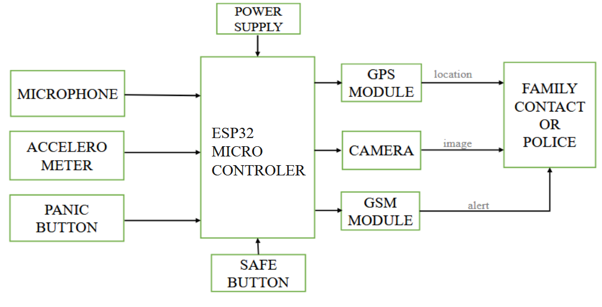
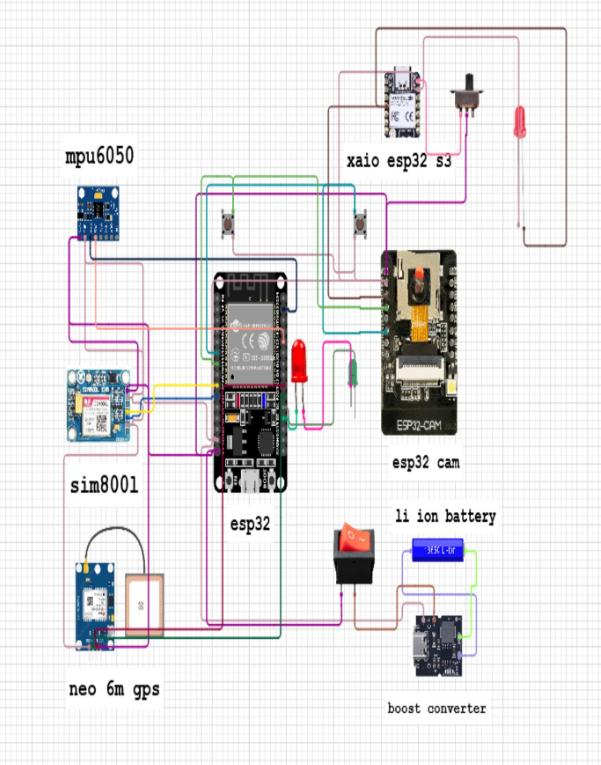
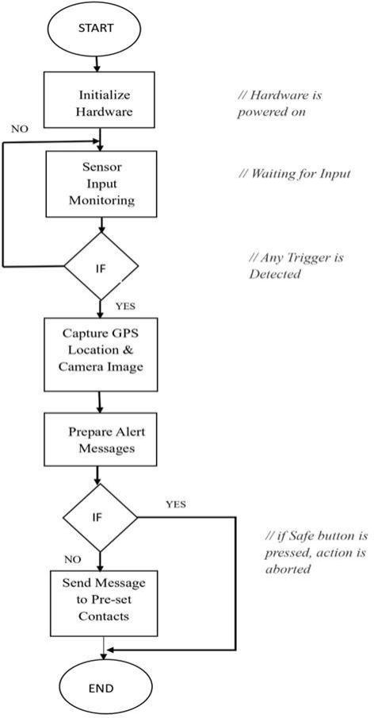
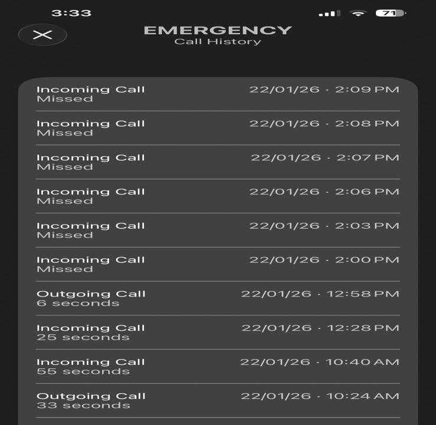
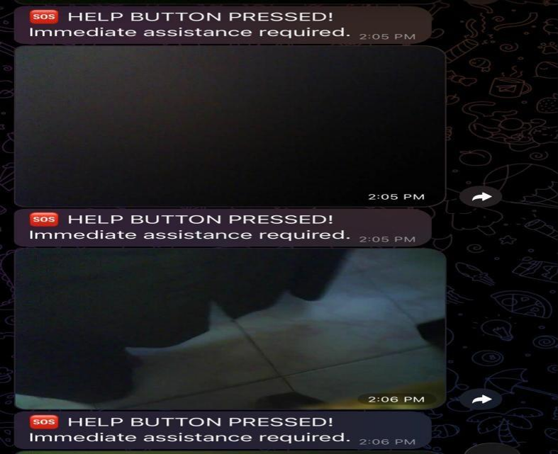
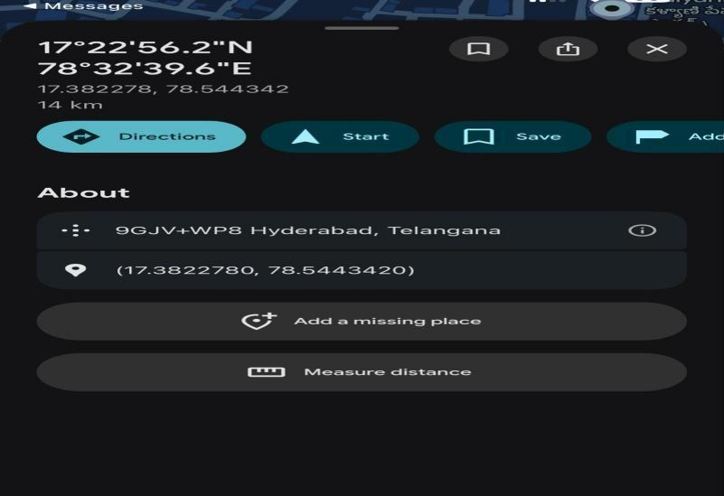
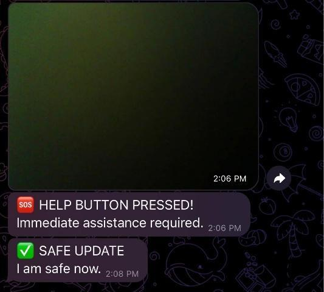
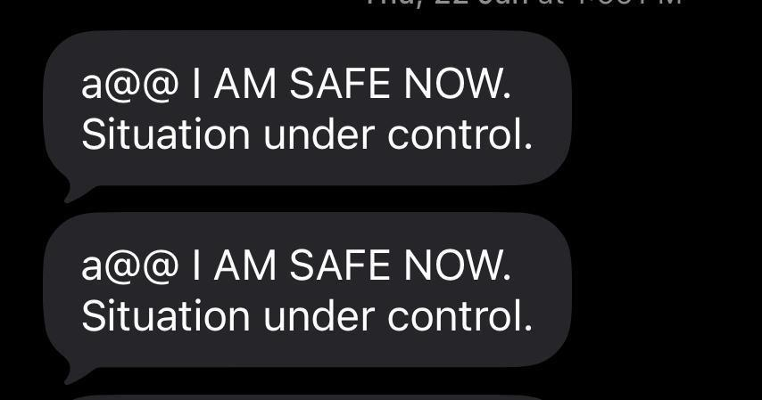
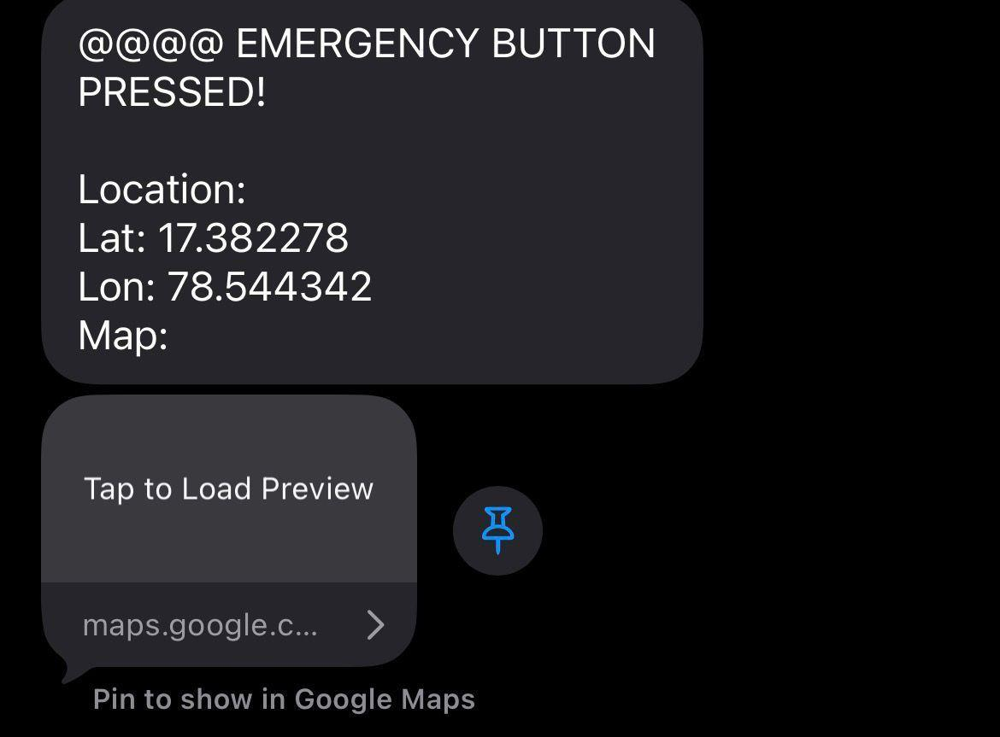

# Personal Safety Device for Women

> **Collaborative M.E. Embedded Systems project exploring sensor integration, wireless communication, IoT connectivity, and edge intelligence in a connected embedded application.**

---

## Project at a Glance

| Category              | Details                             |
| --------------------- | ----------------------------------- |
| **Project Type**      | Collaborative M.E. Academic Project |
| **Domain**            | Embedded Systems & IoT              |
| **Platform**          | ESP32 / ESP32-CAM                   |
| **Sensing**           | MPU6050 / GPS                       |
| **Communication**     | GSM / Wi-Fi                         |
| **Interfaces**        | UART / I²C                          |
| **Edge Intelligence** | TinyML / Voice Recognition          |
| **Development**       | Arduino IDE / Embedded C/C++        |
| **My Role**           | Contributing Team Member            |

---

## Overview

The **Personal Safety Device for Women** was developed as a collaborative Master's-level project in Embedded Systems.

The project explores the integration of:

* Embedded sensing
* GPS-based location acquisition
* GSM communication
* Wi-Fi connectivity
* Camera-based image capture
* Voice recognition
* IoT-based remote communication

The project provided practical exposure to **embedded hardware integration, communication interfaces, wireless connectivity, sensor verification, and system-level testing**.

### Important Attribution

This is **not presented as my independent project**.

The project was developed collaboratively, with the primary development and core design led by another team member. My role was that of a **contributing team member**, with involvement in technical documentation, sensor-output verification, GPS/GSM integration testing, and system-level testing support.

---

# Objective

The project aimed to explore a connected embedded architecture capable of responding to predefined safety-related events through multiple sensing and communication mechanisms.

The overall engineering flow can be represented as:

**Sensing → Embedded Processing → Communication → IoT Connectivity → Remote Alert**

---

# System Architecture

The system combines several embedded subsystems into one connected application.

<p align="center">
  
</p>

### Major functional layers

**1. Sensing**

Collection of information from sensors and user inputs.

**2. Embedded Processing**

Processing of sensor and event information on the embedded platform.

**3. Communication**

Interaction with GPS, GSM, and Wi-Fi subsystems.

**4. Edge Intelligence**

Integration of TinyML-based voice recognition.

**5. Remote Communication**

Transmission of alerts, location information, and captured images through communication services.

---

# Technical Modules

## 1. GPS & GSM Communication

The project incorporates:

* NEO-6M GPS
* SIM800L GSM
* MPU6050
* Emergency/safety inputs

The GPS subsystem provides location information, while GSM provides communication through SMS and voice calls.

### Embedded concepts

`GPS` · `GSM` · `UART` · `I²C` · `Sensor Interfacing`

---

## 2. TinyML Voice Recognition

The project incorporates **TinyML-based voice recognition using Edge Impulse**.

The documented application includes recognition of the emergency command:

**"HELP"**

This represents an example of integrating **edge intelligence into an embedded system**, where voice-related processing forms part of the device-level functionality.

> I do not claim independent development or ownership of the TinyML model. It is described as part of the collaborative system.

---

## 3. ESP32-CAM & Wi-Fi

The system incorporates an ESP32-CAM for:

* Image capture
* Wi-Fi connectivity
* SOS-related communication
* Remote image transmission through Telegram

This demonstrates the combination of **embedded vision and IoT connectivity**.

---

# Communication Interfaces

The project provides exposure to multiple communication mechanisms used in embedded systems.

| Interface    | Application                                |
| ------------ | ------------------------------------------ |
| **UART**     | Serial communication with embedded modules |
| **I²C**      | MPU6050 sensor communication               |
| **GPS**      | Location acquisition                       |
| **GSM**      | SMS and voice communication                |
| **Wi-Fi**    | IoT connectivity                           |
| **Telegram** | Remote notification / image communication  |

Understanding these interfaces is fundamental to integrating multiple peripherals within a connected embedded system.

---

# System-Level Engineering

The project can be viewed as a chain of interacting subsystems:

```text
Sensors / Inputs
       ↓
Embedded Controller
       ↓
Event Processing
       ↓
Communication Interfaces
       ↓
GPS / GSM / Wi-Fi
       ↓
Remote Services
       ↓
User Notification
```

The engineering challenge lies not only in individual modules, but also in their **integration and communication as one system**.

---

# Hardware & Circuit Design

<p align="center">
  
</p>

The circuit documentation illustrates the integration of the embedded controller with sensing and communication components.

---

# System Flow

<p align="center">
  
</p>

The flowchart represents the documented event-handling and system-flow logic.

---

# My Technical Contribution

## Role: Contributing Team Member

My involvement in this collaborative project focused on the following areas:

### Technical Documentation

* Supporting preparation and organization of project documentation
* Documenting system-level information

### Sensor Verification

* Verifying sensor data outputs
* Supporting expected sensor behavior checks

### GPS/GSM Integration

* Assisting with GPS integration testing
* Assisting with GSM integration testing
* Supporting communication verification

### System Integration

* Supporting hardware/software integration activities
* Participating in system-level testing
* Supporting documentation of integration outcomes

### Attribution

I **do not claim sole ownership, primary development, or independent implementation of the complete system**.

This repository is included in my portfolio to demonstrate my **practical exposure to embedded systems, IoT, communication interfaces, sensor integration, and system testing**.

---

# Skills & Technical Exposure

### Embedded Systems

`ESP32` · `ESP32-CAM` · `Embedded C/C++` · `Arduino IDE`

### Sensors & Interfaces

`MPU6050` · `GPS` · `UART` · `I²C`

### Communication

`GSM` · `Wi-Fi` · `Telegram`

### IoT & Edge Intelligence

`IoT` · `TinyML` · `Edge AI` · `Voice Recognition`

### Engineering

`Sensor Integration` · `Hardware–Software Integration` · `System Testing` · `Technical Documentation`

---

# Engineering Concepts Explored

### Sensor Integration

Connecting physical-world sensing elements to an embedded controller.

### Embedded Communication

Using interfaces such as UART and I²C for interaction between embedded components.

### Wireless Connectivity

Using GSM and Wi-Fi to extend embedded functionality beyond the local device.

### IoT Architecture

Connecting embedded hardware with remote communication and notification services.

### Edge Intelligence

Exploring TinyML-based processing within an embedded application.

### Hardware–Software Integration

Combining hardware components, firmware, communication modules, and application-level services into a functional system.

---

# Functional Evidence

The repository contains visual documentation of the project's implementation and demonstrated functionality.

## Emergency Call / Alert

<p align="center">
  
</p>

## Captured Image

<p align="center">
  
</p>

## GPS Location

<p align="center">
  
</p>

## Safety Message

<p align="center">
  
</p>

## Safety Status

<p align="center">
  
</p>

## Project Result

<p align="center">
  
</p>

---

# Source Code & Appendices

The project source code is organized into three appendices accompanying the academic documentation.

## Appendix A — GSM & GPS Emergency Alert System

**File:** `Code/Appendix_A.ino`

Appendix A documents the **GSM and GPS-based emergency alert subsystem**.

The implementation includes interaction with:

* SIM800L GSM
* NEO-6M GPS
* MPU6050
* Emergency and safety inputs
* SMS communication
* Voice-call functionality
* GPS-based location information

### Technical focus

`ESP32` · `Embedded C++` · `GPS` · `GSM` · `UART` · `I²C`

My involvement in this area included **sensor-output verification and assistance with GPS/GSM integration testing**.

---

## Appendix B

**File:** `Code/Appendix_B.ino`

Appendix B contains an additional implementation component associated with the collaborative embedded-system project.

It is retained as part of the complete source-code documentation accompanying the project report.

The file should be considered together with the project documentation when interpreting its specific implementation role.

---

## Appendix C

**File:** `Code/Appendix_C.ino`

Appendix C contains another implementation component associated with the collaborative project.

Together with Appendices A and B, it forms part of the source-code documentation maintained with the academic project.

> **Attribution note:** The presence of these source files in the repository does not imply that I independently authored or developed the complete implementation.

---

# Research Perspective

This project was primarily an **academic engineering project**, rather than an independent research project.

However, it provided exposure to several areas relevant to my broader technical interests:

```text
Embedded Systems
       ↓
Sensor Integration
       ↓
Communication Interfaces
       ↓
IoT Connectivity
       ↓
Edge Intelligence
       ↓
Intelligent Connected Systems
```

The project strengthened my interest in understanding how **resource-constrained embedded platforms can sense, process, communicate, and respond intelligently in connected environments**.

---

# PhD / Research Relevance

The significance of this project in my portfolio is based on **technical exposure rather than project ownership**.

It demonstrates experience around:

* Embedded platforms
* Sensor interfaces
* GPS/GSM systems
* Wireless communication
* IoT connectivity
* Edge intelligence
* Hardware/software integration
* System verification
* Technical documentation

These experiences complement my broader interests in:

**Embedded Systems · IoT · Edge AI · TinyML · Real-Time Systems · Communication Systems · Hardware–Software Co-Design**

---

# Scope & Limitations

* Collaborative Master's academic project.
* I was a contributing team member.
* Primary development and core design were led by another team member.
* My contribution is limited to the areas explicitly described above.
* The repository represents an academic embedded/IoT prototype.
* It is not presented as a production-ready or clinically validated safety system.
* Technical capabilities are described according to the documented project implementation.

---

# Project Documentation

The repository contains the academic project report:

```text
ProjectReport.pdf
```

The report provides the detailed documentation accompanying the implementation.

---

# Repository Structure

```text
Personal-safety-device-for-women/
│
├── Code/
│   ├── Appendix_A.ino
│   ├── Appendix_B.ino
│   └── Appendix_C.ino
│
├── Images/
│   ├── Block_diagram.png
│   ├── Call_Alert.png
│   ├── Captured_Image.png
│   ├── Circuit_diagram.png
│   ├── Flowchart.png
│   ├── GPS_Location.png
│   ├── Result.png
│   ├── SafeMessage.png
│   └── Safenow.png
│
├── ProjectReport.pdf
└── README.md
```

---

# Technical Interests

My broader technical interests include:

**Embedded Systems** · **IoT** · **Edge AI** · **TinyML** · **Real-Time Systems** · **Communication Systems** · **Hardware–Software Co-Design** · **Intelligent Connected Devices**

---

## Project Summary

> **A collaborative M.E. Embedded Systems project integrating sensing, GPS/GSM communication, Wi-Fi, camera functionality, IoT services, and TinyML-based voice recognition. My contribution focused on technical documentation, sensor-output verification, GPS/GSM integration testing, and system-level testing support.**
